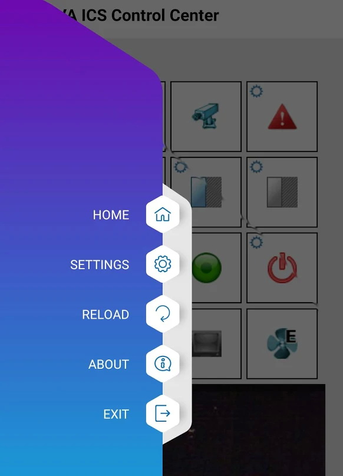
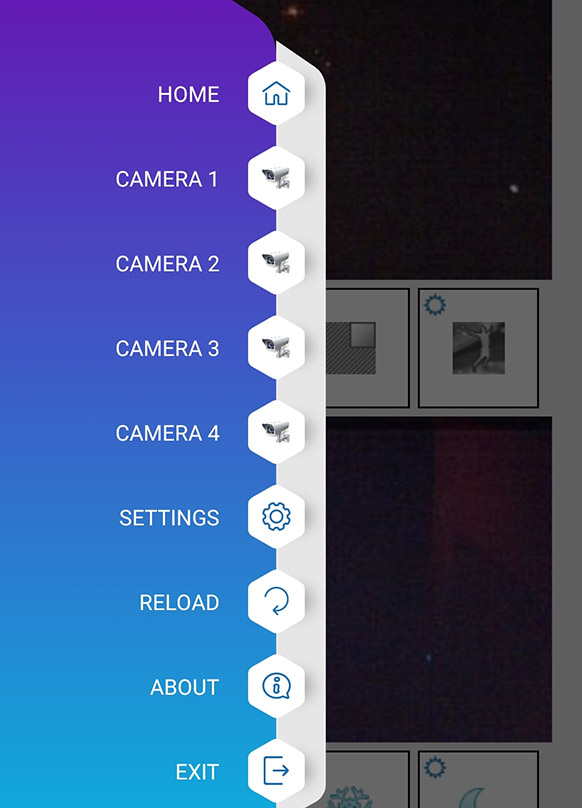
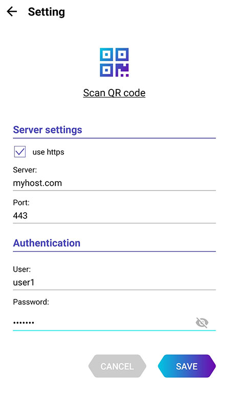

What is evaHI?
--------------

evaHI is Android application template which allow you to quickly build custom
Android app viewer for your mobile web application.

<div>


</div>

Why do I need this?
-------------------

Of course, users can just open your web application via mobile web browser.

But evaHI provides additional features:

* Your web-app will look as cool as any native Android app and your custom
  viewer app can be added to Google Play Store

* You can hard-code connection parameters of your web-app or users can quickly
  configure it with QR codes
  
  

* The app can automatically pass basic authentication forms

* The app provides native navigation menu with custom icons and menu labels

* Icons, menu labels and target URLs can be changed dynamically on your web-app
  server so users don't need to download application updates again and again

* The app can switch URLs depending is current device mode portrait or
  landscape

Looks cool. How can I build my own app?
---------------------------------------

Customize app source:

* Download evaHI source (git clone https://github.com/alttch/evaHI)
* Edit prepare.ini file
* Run ./prepare -D <your_app_dir>
* Go to <your_app_dir>, customize app icons in ./app/src/main/res (optional)
* Build your app with Android Studio or other Android build tool

Create configuration file on your web server
--------------------------------------------

* Create .evahi directory in your web server http root

* Put there the following configuration file. The file should be named
  config.yml, config.yaml or config.json (if JSON format is used)

```yaml
serial: 1
index: /index.html
index_landscape: /landscape.html
home_icon: h.jpg
menu:
- {icon: pages/page1.png, name: Page 1, url: /page1.html}
- {icon: pages/contacts.png, name: Contacts, url: /contacts.html}
```

All icons should be placed in /.evahi/icons/ dir and have relative paths in
app configuration.

The app caches configuration settings and icons, but reloads them if **serial**
field is increased.

Configuration QR codes
----------------------

User can scan QR codes with settings to quickly configure the app. QR code
format is:

    scheme:https|address:yourserver.com|port:443|user:test|password:123
  
Fields _user_ and _password_ are optional.

Authentication
--------------

evaHI sends username/password only if basic authentication is set up. However
your web application may automatically evaHI client (by HTTP *User-Agent* =
'evaHI ...' header) and ask it to provide authentication credentials returning:

    HTTP/1.1 401 Unauthorized
    WWW-Authenticate: Basic realm="?"

and the application will repeat HTTP request with authentication headers
included.

Any examples?
-------------

Our [EVA ICS](https://www.eva-ics.com/) Control Center Android app is fully
evaHI-based.

source: https://github.com/alttch/evacc/
app: https://play.google.com/store/apps/details?id=com.altertech.evacc

